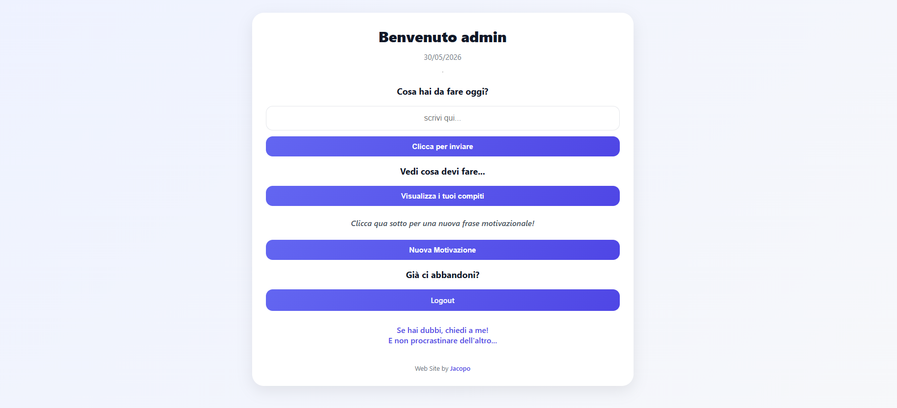
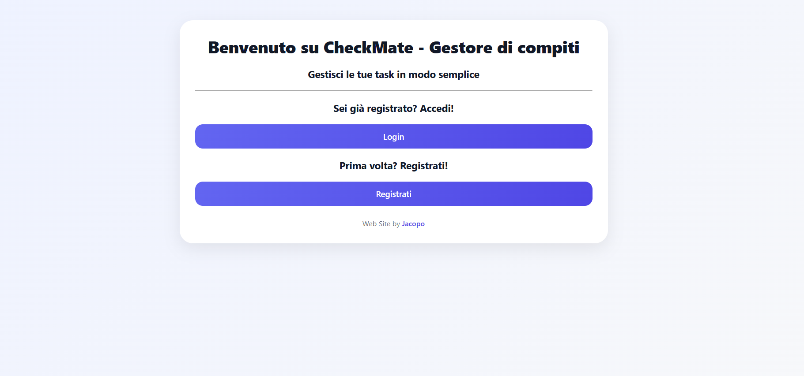
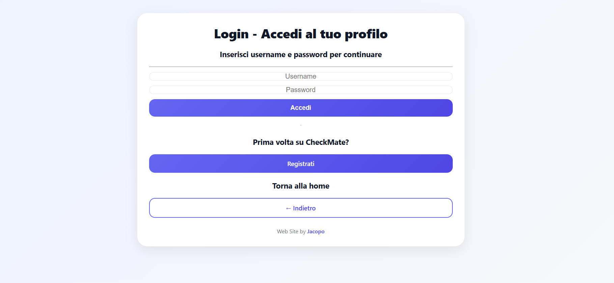
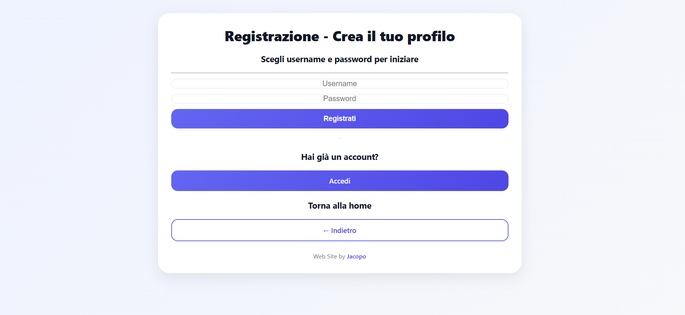
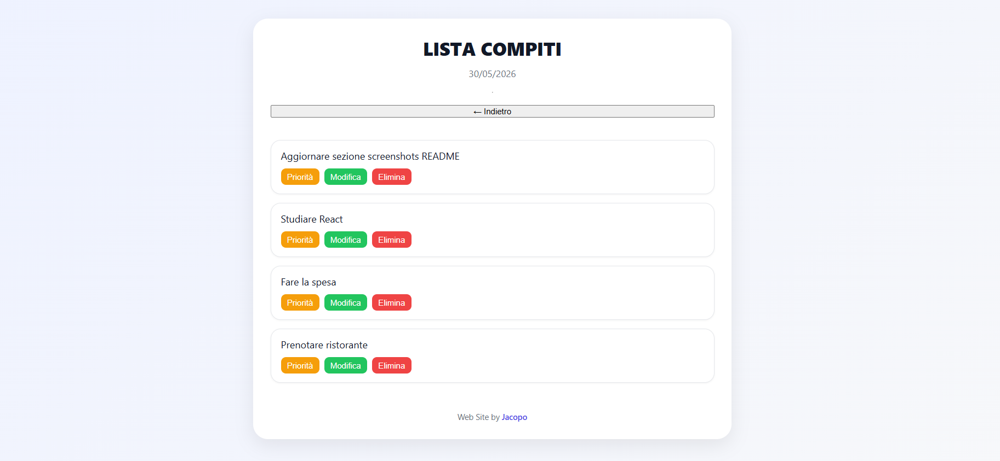

# CHECKMATE - Gestore Compiti Personale


---

## Descrizione del progetto

CheckMate è una web app per la gestione di compiti personali sviluppata con Flask e SQLite come progetto didattico durante il corso IFTS Software Developer.  

L'obiettivo del progetto è approfondire lo sviluppo full stack, comprendendo l'interazione tra frontend, backend e database attraverso la realizzazione di un'applicazione completa con autenticazione utenti e gestione delle task.

L'applicazione consente di:

* Registrare un nuovo account
* Effettuare login e logout
* Accedere a un'area personale protetta
* Creare, visualizzare, modificare ed eliminare task
* Salvare i dati in un database SQLite
* Gestire task separate per ogni utente autenticato
* Priorità task (solo UI, non persistita)

---

## Anteprima



---

## Obiettivo del progetto

Il progetto è stato sviluppato a scopo didattico/formativo per il corso   
**IFTS Software Developer (FISM FORMAZIONE)**  
L'obiettivo è comprendere le relazioni tra:
- Database
- Backend
- Frontend

attraverso la realizzazione di una web app completa.

---

## Funzionalità

- Registrazione utenti
- Login e logout
- Password hashate
- Sessioni con Flask-Login
- CRUD completo delle task
- Multiutente
- SQLite database
- Frontend HTML/CSS/JavaScript

---

## Tecnologie utilizzate

| Layer     | Stack                                                      |
|-----------|------------------------------------------------------------|
| Backend   | Python 3.10+, Flask 3, Flask-Login                         |
| Database  | SQLite (`sqlite3`)                                         |
| Frontend  | HTML, CSS, JavaScript                                      |
| Sicurezza | Werkzeug (`generate_password_hash`, `check_password_hash`) |

---

## Caratteristiche tecniche

- Autenticazione tramite Flask-Login
- Password memorizzate tramite hashing Werkzeug
- Sessioni utente persistenti
- Relazione uno-a-molti tra utenti e task
- API REST per gestione autenticazione e task
- Separazione frontend/backend

---

## Struttura del progetto

```text
checkmate/
│
├── README.md
├── INSTALLAZIONE.md
├── requirements.txt
├── .gitignore
├── LICENSE.md
├── app.py
│
├── templates/
│   ├── index.html
│   ├── first.html
│   ├── login.html
│   ├── register.html
│   └── tasks.html
│
├── static/
│   ├── style.css
│   ├── script.js
│   ├── tasks.js
│   ├── login.js
│   ├── register.js
│   └── buttons.js
│
├── models/
│   └── user.py  # modello Flask-Login
│
├── database/  # creato al primo avvio (non versionato)
│    
├── screenshots/
    ├── landing-page.png
    ├── login-page.png
    ├── register-page.png
    ├── dashboard.png
    └── tasks-page.png
```
---

## Screenshot

### Landing Page



### Login



### Registrazione



### Gestione Tasks



---

## Installazione e avvio

Leggi la [guida per l'installazione](/INSTALLAZIONE.md) per i dettagli.

---

## Route principali

| Route                         | Descrizione                    | Auth |
|-------------------------------|--------------------------------|------|
| `/`                           | Landing page                   | No   |
| `/login`, `/register`         | Autenticazione                 | No   |
| `/index`                      | Home utente, aggiunta task     | Sì   |
| `/tasks`                      | Lista compiti                  | Sì   |
| `/logout`                     | Logout                         | Sì   |
| `/api/register`, `/api/login` | API auth                       | No   |
| `/api/tasks`                  | GET/POST compiti               | Sì   |
| `/api/tasks/<id>`             | PUT/DELETE compito             | Sì   |

---

## Limitazioni note

- Le priorità sono solo visive: non vengono salvate nel database.
- Il campo completato esiste nel DB ma non è ancora usato nell’interfaccia.
- La configurazione è pensata per sviluppo locale; per un deploy in produzione è consigliato utilizzare variabili d'ambiente per la gestione della SECRET_KEY e di altre impostazioni sensibili.

---

## Autori e Licenza

- Jacopo Nesti
- Questo progetto è rilasciato sotto licenza MIT. Vedi file [LICENSE](/LICENSE.md) per i dettagli.